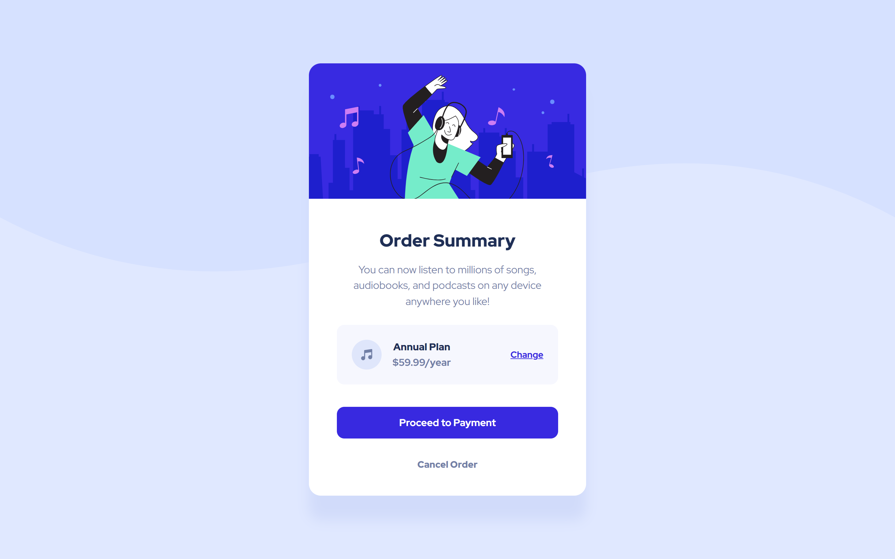

# 💻 Frontend Mentor - Order Summary Component Main

### Olá! 🌞

### Guia de conteúdo:

- [Visão geral](#visao-geral)
- [Processo](#processo)
  - [Tecnologias usadas](#tecnologias)
  - [O que aprendi](#o-que-aprendi)

### Visão geral
Desafio simples que pede a construção de um card sem interação com usuário para além das mudanças no botão e link "change" com o passar do mouse em telas desktop.

### Processo
Desta vez, para o card, usei a tag "article". Para a estilização, novamente usei a sintaxe SASS (.scss) para continuar praticando o que aprendi anteriormente em um curso. Em desafios anteriores tinha encontrado dificuldade em posicionar corretamente o padrão de plano de fundo, mas desta vez não tive problemas.

### Tecnologias
- HTML
- SASS (.scss)

### O que aprendi
Não necessariamente algo que aprendi com este desafio, mas que ainda não havia usado antes: "&" para selecionar outra classe e "mixin" para mudar o cursor com o passar do mouse em telas telas desktop.

### Meus perfis
   - [Front-end Mentor](https://www.frontendmentor.io/profile/instmi)
   - [Twitter](https://twitter.com/instmi_studies)
   - [LinkedIn](https://www.linkedin.com/in/milenaoandrade/)